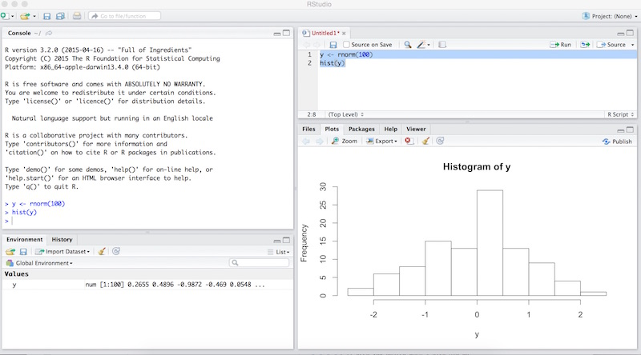

## R and thinking in R

R is a statistical package designed for analysis and (some) data management. 

The strength of R is its price (free) and its flexibility in working with different types of analysis contexts. It can do summary statistics, plots, regressions, and multilevel regressions. It is also very fast and works well in a production environment when combined with R-studio and R-markdown (this presentation is coded in R markdown)

The weakness of R is data management. For example, there is no native "recode" command. 

The trick with R is to think about data AND results as objects (or a series of lists, vectors, and matrices)

## Where to get R and other helpful programs

You can download R from <http://www.r-project.org>, or specifically <http://cran.rstudio.com>. Just download and install. 

You can also download R-studio at <http://www.rstudio.com>. It does make life easier

For this class, you can run R by booting the virtual machine and pointing your browser to 

[127.0.0.1:8787](127.0.0.1:8787)

---




## Interacting with R

When you fire up R using R studio, you are presented with the Console window. This window allows you to enter in commands that are a combination of input and functions. You can enter commands at the `>` prompt. 

R is a big calculator, so you can enter, for example, an expression

```{r}
1+2+3
```


## What I am going to show you

R can read and manage complex data sets. However, for this course, we will just focus on entering small amounts of data and performing basic analyses on them using R. Once you feel comfortable with these operations, you can soon get the hang of more complex stuff. 

As a side note, R has thousands of little add on packages to do advanced things. In this class we won't worry about these either, all you need to download is the main program. 

# Using R

## Basics

Again, you just type stuff into R and it answers you. After a while, you will learn to write programs, which are lists of stuff you would type in. 

R works like a calculator, you can just type in math problems and it will answer them. For example

```{r}
1+1
```

----

Note that in this document, the stuff you type in will be in grey boxes and answers will follow `##`. R sometimes provides an index if the answer has multiple rows and columns, e.g.,
```{r}
rbind(c(1,2),c(3,4))
```
but most of the time the answer is just one row, and that is why you sometimes see `[1]` in the answers.
```{r}
pi
```

----

Also, you can split what you enter into different lines if you want.

```{r}
1+
  1
```

## Objects

----

R works with objects.  A number is an object, a set of numbers is also an object. The results of an analysis is also an object in R.  In R, functions create and do things with objects.  

## Functions

----

In this class you will be working with sets of numbers (as objects) and functions (that work with the objects). A function in R follows two basic forms. The first type of function creates objects from other items. For example, suppose there was a function `func`, the basic syntax would be

```
func(material to make an object)
```

----

The second type of function takes your "object" and produces statistics about it. These functions follow the following syntax

```
func(object, options)
```
where you tell R what to get your statistics about, followed by a comma and then some options. Sometimes we don't have options, sometimes we do. 

----

## Working with data, creating collections (i.e., sets of data or "data sets")

The most important function for getting data into R is the `c` function. Keep in mind that **order matters**.  

Suppose we want to collect the numbers 10, 4, 3, 8, 3, 4, 8, 1, 2, and 3, into a variable `y`. We simply type in 

```{r}
y <- c(10, 4, 3, 8, 3, 4, 8, 1, 2, 3)
```
The `<-` is the assignment operator; the object `y` is assigned the collection of numbers. Think of the `c` function as *collecting* the numbers into the collection `y`. We can also think of `y` as a variable. 

----

We can see what `y` is by just typing 
```{r}
y
```

----

For nominal variables, we typically enter data as strings in quotes

```{r}
k <- c("A","A","B","C","A","C","B","B","C","A")
k
```

Strings are just another way computers store information.  Either the bits store numbers as quantities, or as codes that represent letters (strings).  We tell R that we want something as a string by putting it in quotes.

## Acting on data

You can do things to your list of numbers.  For example, you can add 1 to each of them

```{r}
y
y+1
```

----

Or you can square each of them

```{r}
y
y^2
```

---

You can combine actions

```{r}
y
((y-3)^2)/4
```

----

Finally, you can do things to the set of numbers, like add them up

```{r}
y
sum(y)
```

----

Or do things to each element, then add them up

```{r}
y
sum(((y-3)^2)/4)
```

Once we have a collection of numbers, in `y`, we can get many statistics about this collection using the second type of functions that generates statistics

``` {r}
summary(y)
mean(y)
```

----

``` {r}
# Medians use the quantile command
sort(y)
quantile(y, probs = .5, type = 1) #normal
quantile(y, probs = .5, type = 2) #averaging
```

----

``` {r}
quantile(y, probs = .5, type = 3) #sas
quantile(y, probs = .5, type = 4) #linear interpolation
quantile(y, probs = .5, type = 6) #spss kind
```

----

``` {r}
var(y)
sd(y)
range(y)
```

----

``` {r}
stem(y)
```

----

## R functions for functions in your book

Your book often makes use of the number of elements in a series of data, $N$, again, you can get this in R with the `length` function
```{r}
length(y)
```

----

To sum a series of data, $\sum$, you can use the `sum` function, for example
```{r}
sum(y)
```
is $\sum y_i$

----

To sum a series of data with operations you can still use the `sum` function, for example
```{r}
sum((y-mean(y))^2)
```
is $\sum\left(y_i-\bar{y}\right)^2$.  Note that you can just use the `mean` function in place of the mean.

## Creating functions

Sometimes, R will not have a function that we need.  No worries, we can write our own.  For example, let's say R did not have a function for the average (which it does, its called `mean`).

We can write a function.  The anatomy of a function is 

```
nameoffunction <- function(arguments) {
  stuff to do with arguments
  return(stuff to return or show on screen)
}
```

---

For example, we could create a function call `average` which calcualtes the average

\[
average = \frac{\sum y_i}{N}
\]

For this function, the argument will be the name of the data, `v`, for variable, and we will get the sum of that variable and the length of that variable, then calcuate the average, then return that number back.

---

```{r}
  average <- function(v) {
    sum.of.v <- sum(v)
    N.of.v <- length(v)
    result <- sum.of.v/N.of.v
    return(result)
  }
```

Then, with this function in hand, we can get the average of something

```{r}
average(y)
```

## Frequency tables

Frequency tables are little bit of a pain in R. (This is the hardest thing you will have to do in R.) 

First, you need to get the frequencies using the `table` function. The `table` function will produce a frequency table

```{r}
table(y)
```
Which looks a little weird. The top row contains the values of `y` and the the bottom row shows the frequency for each value. 

----

Typical frequency tables are made up of frequencies, percents, and cumulative percents. Thus, we need to embed functions within functions to make a proper frequency table. 
```{r}
cbind(Freq. = table(y), 
   Percent = 100*prop.table(table(y)),
   Cum.Percent = cumsum(100*prop.table(table(y))))
```
----

This function uses the `prop.table` function, which calculates the proportions and `cumsum`, which adds things up cumulatively, and `cbind`, which binds the different columns together.  You can also reverse the table by adding `rev` functions to it.
   
---

```{r}
cbind(Freq. = rev(table(y)), 
   Percent = rev(100*prop.table(table(y))),
   Cum.Percent = rev(cumsum(100*prop.table(table(y)))))
```
----

## Deviance scores

`cbind` is also useful for looking at deviance scores.  For example, to see that deviance and squared deviance of `y` from the mean of `y`

```{r}
cbind(y, Dev = y - mean(y),
  Sq.dev = (y - mean(y))^2)
```

## Population variance

If you want to calculate the population variance (the one that uses N and not N-1)
\[
\mbox{Population Variance} = \frac{\sum_{i=1}^N\left(y_i - \bar{y}\right)^2}{N}
\]
```{r}
sum((y-mean(y))^2)/length(y)
```
note that there is no function for this in R, because in practice it is never used. 

----

We could break this up into steps by creating objects

```{r}
N <- length(y)
```
Here we created an object `N` that is the number of numbers in object `y`.  Next, we create an object of the squared deviations

```{r}
dev2 <- (y-mean(y))^2
```
then the final formula
```{r}
sum(dev2)/N
```

## Sample variance

If you want to calculate the sample variance (the one that uses N-1 and not N)
\[
\mbox{Sample Variance} = \frac{\sum_{i=1}^N\left(y_i - \bar{y}\right)^2}{N-1}
\]

```{r}
sum((y-mean(y))^2)/(length(y)-1)
```
Note we could also use the `var` function. 
```{r}
var(y)
```

----

## Population tests

Note that R does not have functions for population tests, because we never really use them.  So, you will have to roll your own.  For example, suppose we wanted to test whether the mean of `y` was equal to a population mean of 7?  We need the mean, $\bar{y}$, the null hypothesis value, $\mu$, the number of cases, $N$, and the sample variance $\sigma^2$.  The z-test is 
\[
z = \frac{\bar{y}-\mu}{\sqrt{N^{-1}\sigma^2}}
\]

----

We can do this step by step in R. 
\[
\sigma^2 = \frac{\sum_{i=1}^N\left(y_i - \bar{y}\right)^2}{N}
\]
```{r}
sigma2 <- sum((y-mean(y))^2)/(length(y))
```

----

Then, we can set `mu` and do the $z$ test.  Suppose the null hypothesis is 7,
\[
z = \frac{\bar{y}-\mu}{\sqrt{N^{-1}\sigma^2}}
\]
```{r}
mu <- 7
(mean(y)-mu)/sqrt(sigma2/length(y))
```
----

# The *Z*, *t*, *F*, and $\chi^2$, distributions

Your text has lots of tables in the back of the book for the *Z*, *t*, *F*, and $\chi^2$, probability functions. R has the functions for all these functions built in. Functions that begin with `p` will give you probabilities and functions that begin with `q` will give quantiles.  The graphs are also made int R, but the code is a little complex so I won't show that to you. 

## The normal ($Z$) distribution

To find the upper-tail value of $Z$ for $\alpha$ = 0.05 (one tailed) we can use the `qnorm` function
```{r}
qnorm(.05, lower.tail = FALSE)
```

```{r echo = FALSE}
z <- seq(-3, 3, length = 500)
cden <- dnorm(z, log = FALSE)
critR <- qnorm(0.05, lower.tail = FALSE)
alphaR.y <- c(0, dnorm(seq(critR, 3, 0.01), log = FALSE), 0)
alphaR.x <- c(critR, seq(critR, 3, 0.01), 5)
plot(z, cden, type = "l", ylab = "Density")
polygon(alphaR.x, alphaR.y, col = "black")
title(main = "qnorm(.05, lower.tail = FALSE)", xlab = "z")
```

----

To find the lower-tail value of $Z$ for $\alpha$ = 0.05 (one tailed) we can use the `qnorm` function

```{r}
qnorm(.05, lower.tail = TRUE)
```

```{r echo = FALSE}
z <- seq(-3, 3, length = 500)
cden <- dnorm(z, log = FALSE)
critL <- qnorm(0.05, lower.tail = TRUE)
alphaL.y <- c(0, dnorm(seq(-3, critL, 0.01), log = FALSE), 0)
alphaL.x <- c(critL, seq(-3, critL, 0.01), critL)
plot(z, cden, type = "l", ylab = "Density")
polygon(alphaL.x, alphaL.y, col = "black")
title(main = "qnorm(.05, lower.tail = TRUE)", xlab = "z")
```

----

To find the upper-tail value of $Z$ for $\alpha$ = 0.05 (two tailed) we divide $\alpha$ by 2
```{r}
qnorm(.05/2, lower.tail = FALSE)
```
To find the lower-tail value of $Z$ for $\alpha$ = 0.05 (two tailed) we divide $\alpha$ by 2
```{r}
qnorm(.05/2, lower.tail = TRUE)
```

----

```{r echo = FALSE}
z <- seq(-3, 3, length = 500)
cden <- dnorm(z, log = FALSE)
critL <- qnorm(0.05/2, lower.tail = TRUE)
alphaL.y <- c(0, dnorm(seq(-3, critL, 0.01), log = FALSE), 0)
alphaL.x <- c(critL, seq(-3, critL, 0.01), critL)
critR <- qnorm(0.05/2, lower.tail = FALSE)
alphaR.y <- c(0, dnorm(seq(critR, 3, 0.01), log = FALSE), 0)
alphaR.x <- c(critR, seq(critR, 3, 0.01), 5)
plot(z, cden, type = "l", ylab = "Density")
polygon(alphaL.x, alphaL.y, col = "black")
polygon(alphaR.x, alphaR.y, col = "black")
title(main = "qnorm(.05/2, lower.tail = TRUE) \n and \n qnorm(.05/2, lower.tail = FALSE)", xlab = "z")
```

----

What is the percentile for a $Z$ score of 1.234? Use the `pnorm` function and multiply by 100

```{r}
100*(pnorm(1.234))
```

```{r echo = FALSE}
z <- seq(-3, 3, length = 500)
cden <- dnorm(z, log = FALSE)
critL <- 1.234
alphaL.y <- c(0, dnorm(seq(-3, critL, 0.01), log = FALSE), 0)
alphaL.x <- c(critL, seq(-3, critL, 0.01), critL)
plot(z, cden, type = "l", ylab = "Density")
polygon(alphaL.x, alphaL.y, col = "black")
title(main = "pnorm(1.234)", xlab = "z")
```

----

To find the percent between two values of $Z$, say the percent between $Z=2$ and $Z=0$, we can use the `pnorm` function twice
```{r}
100*(pnorm(2)-pnorm(0))
```

```{r echo = FALSE}
z <- seq(-3, 3, length = 500)
cden <- dnorm(z, log = FALSE)
alphaL.y <- c(0, dnorm(seq(0, 2, 0.01), log = FALSE), 0)
alphaL.x <- c(0, seq(0, 2, 0.01), 2)
plot(z, cden, type = "l", ylab = "Density")
polygon(alphaL.x, alphaL.y, col = "black")
title(main = "pnorm(2)-pnorm(0)", xlab = "z")
```

----

We can create a confidence interval for a given set of data (assuming they are the population) with the following code that employs many of the functions presented up to this point.  That is, for a 95% CI ($\alpha$ = 0.05)

```{r}
alpha <- 0.05
samp.var <- (sum((y-mean(y))^2)/(length(y)))/length(y)
lower <- mean(y) + qnorm(alpha/2)*
  sqrt(samp.var)
upper <- mean(y) - qnorm(alpha/2)*
  sqrt(samp.var)
paste(round(lower, digits = 3), 
  ", " , round(upper, digits = 3))
```
where `paste` pastes elements together. 

## $t$ distribution

We can also find the critical values for the other distributions given the degrees of freedom. For example, given 10 degrees of freedom, to find the value of $t$ for $\alpha$ = 0.05 (one tailed) we can use the `qt` function
```{r}
qt(.05, 10, lower.tail = FALSE)
```
To find the value of $t$ for $\alpha$ = 0.05 (two tailed)
```{r}
qt(.05/2, 10, lower.tail = FALSE)
```

----

```{r echo = FALSE}
t <- seq(-3, 3, length = 500)
cden1 <- dt(t, 1, log = FALSE)
cden2 <- dt(t, 2, log = FALSE)
cden3 <- dt(t, 3, log = FALSE)
cden4 <- dt(t, 4, log = FALSE)
cden5 <- dt(t, 5, log = FALSE)
plot(t, cden5, type = "l", ylab = "Density")
lines(t, cden4, type = "l", ylab = "Density")
lines(t, cden3, type = "l", ylab = "Density")
lines(t, cden2, type = "l", ylab = "Density")
lines(t, cden1, type = "l", ylab = "Density")
title(main = "t distributions")
```

----

Here is a confidence interval using a $t$ distribution

```{r}
alpha <- 0.05
samp.var <- (sum((y-mean(y))^2)/(length(y)-1))/length(y)
lower <- mean(y) + qt(alpha/2, length(y)-1)*
  sqrt(samp.var)
upper <- mean(y) - qt(alpha/2, length(y)-1)*
  sqrt(samp.var)
paste(round(lower, digits = 3), 
  ", ", round(upper, digits = 3))
```


## The $F$ distribution

The functions for the $F$ distribution are very similar, except now we have two degrees of freedom, one for numerator and one for the denominator. For example, given 1 degree of freedom in the numerator and 10 degrees of freedom in the denominator, to find the value of $F$ for $\alpha$ = 0.05 we can use the `qf` function
```{r}
qf(.05, 1, 10, lower.tail = FALSE)
```

----

```{r echo = FALSE}
f <- seq(0, 5, length = 500)
cden2 <- df(f, 2, 30, log = FALSE)
cden3 <- df(f, 3, 30, log = FALSE)
cden4 <- df(f, 4, 30, log = FALSE)
cden5 <- df(f, 5, 30, log = FALSE)
plot(f, cden2, type = "l", ylab = "Density")
lines(f, cden3, type = "l", ylab = "Density")
lines(f, cden4, type = "l", ylab = "Density")
lines(f, cden5, type = "l", ylab = "Density")
title(main = "F distributions")
```

## The $\chi^2$ distribution

Finally, the $\chi^2$ distribution. For example, given 1 degree of freedom, to find the value of $\chi^2$ for $\alpha$ = 0.05 we can use the `qchisq` function
```{r}
qchisq(.05, 1, lower.tail = FALSE)
```

----

```{r echo = FALSE}
x <- seq(.5, 10, length = 500)
cden1 <- dchisq(x, 1, log = FALSE)
cden2 <- dchisq(x, 2, log = FALSE)
cden3 <- dchisq(x, 3, log = FALSE)
cden4 <- dchisq(x, 4, log = FALSE)
cden5 <- dchisq(x, 5, log = FALSE)
plot(x, cden1, type = "l", ylab = "Density")
lines(x, cden2, type = "l", ylab = "Density")
lines(x, cden3, type = "l", ylab = "Density")
lines(x, cden4, type = "l", ylab = "Density")
lines(x, cden5, type = "l", ylab = "Density")
title(main = "Chi-square distributions")
```

# Hypothesis testing

This is where R really helps out. 

----

You can perform statistical tests on data with R. We can do a large variety of tests using several functions: `t.test`, `aov` (Analysis of Variance), `chisq.test`, `cor.test` (correlation), and `lm` (linear model), among others. 

----

## Population tests

`pnorm` is  useful for getting $p$ values for our population $z$ tests. For a one tailed test (less-than is the `lower.tail`)

```{r}
pnorm((mean(y)-mu)/sqrt(sigma2/length(y)), lower.tail = TRUE)
```

One-tailed "greater-than" test

```{r}
pnorm((mean(y)-mu)/sqrt(sigma2/length(y)), lower.tail = FALSE)
```

----

Two-tailed, take the absolute value of the test, use the upper-tail, and double the p-value

```{r}
2*pnorm(abs((mean(y)-mu)/sqrt(sigma2/length(y))), lower.tail = FALSE)
```

## $t$-tests

$t$ tests are actually easier, because all the computations and $p$-values are built in a function.  If you want to do a two-tailed one-sample $t$-test of the mean, you can type
```{r}
t.test(y, mu = 0, alternative = "two.sided")
```

----

Other examples of this command include

```
t.test(y, mu = 0, alternative = "two.sided")
t.test(y, mu = 0, alternative = "less")
t.test(y, mu = 0, alternative = "greater")
```
where `mu` is the null hypothesis and `alternative` specifies the tails: either `two.sided`, `less`, or `greater`.

----

If you want to do a one-tailed one-sample $t$-test of the mean, assuming the mean is `less` than 0, you can type
```{r}
t.test(y, mu = 0, alternative = "less")
```

----

If you want to do a one-tailed one-sample $t$-test of the mean, assuming the mean is `greater` than 0, you can type
```{r}
t.test(y, mu = 0, alternative = "greater")
```

----

Next, suppose we have another group of cases with values 7, 3, 6, 2, 9, 8, 2, and 9. We can create another collection and call it `q`. We simply type in 

```{r}
q <- c(7, 3, 6, 2, 9, 8, 2, 9)
q
mean(q)
```

----

If we want to perform a two-tailed two sample test (assuming equal variances) to test the difference between the mean of `y` and the mean of `q`, we type

```{r}
t.test(y, q, alternative = "two.sided", var.equal = TRUE)
```

----

If we want to perform a one-tailed two sample test (assuming equal variances) to test the difference between the mean of `y` and the mean of `q`, where we think the mean of `y` is `less` than `q` we type

```{r}
t.test(y, q, alternative = "less", var.equal = TRUE)
```

----

If we want to perform a one-tailed two sample test (assuming equal variances) to test the difference between the mean of `y` and the mean of `q`, where we think the mean of `y` is `greater` than `q` we type

```{r}
t.test(y, q, alternative = "greater", var.equal = TRUE)
```

----

If we want to perform a two-tailed two sample Welch test to test the difference between the mean of `y` and the mean of `q`, we use the same `t.test` function

```{r}
t.test(y, q, alternative = "two.sided")
```

----

If we want to perform a one-tailed two sample Welch test to test the difference between the mean of `y` and the mean of `q`, where we think the mean of `y` is `less` than `z` we type

```{r}
t.test(y, q, alternative = "less")
```

----

If we want to perform a one-tailed two sample Welch test to test the difference between the mean of `y` and the mean of `q`, where we think the mean of `y` is `greater` than `q` we type

```{r}
t.test(y, q, alternative = "greater")
```

----

Suppose that for each our numbers in `y`, we had paired values of another variable, `x`, with values 7, 1, 6, 2, 5, 6, 4, 1, 4, and 6. We simply type in 

```{r}
x <- c(7, 1, 6, 2, 5, 6, 4, 1, 4, 6)
x
```

Keep in mind that **order matters** a lot here. That, the first value in `y` is associated with the first value of `x`, the second value of `y` and the second value of `x` are also associated, and so on. 

----

If we wanted to see the two variables side by side, we could type

```{r}
cbind(y, x)
```

----

If we wanted to see the difference between the two variables side by side with the `y` and `x`, we could type

```{r}
cbind(y, x, Diff = y-x)
```

----

What is the average mean difference?  We just get the `mean` of it

```{r}
mean(y-x)
```

----

If we want to perform a two-tailed paired sample test to test the average difference between `y` and `x`, we type

```{r}
t.test(y, x, alternative = "two.sided", paired = TRUE)
```

----

If we want to perform a one-tailed paired sample test to test the average difference between `y` and `x`, where we think the mean of `y` is `less` than `x` we type

```{r}
t.test(y, x, alternative = "less", paired = TRUE)
```

----

If we want to perform a one-tailed paired sample test to test the average difference between `y` and `x`, where we think the mean of `y` is `greater` than `x` we type

```{r}
t.test(y, x, alternative = "greater", paired = TRUE)
```

## One-way ANOVA (Analysis of Variance)

Simple one-way ANOVA is also manageable. However, entering the data is a little tricky. Suppose we have three groups, that we call A, B, and C. Each has a set of values (and there can be differing numbers of values). The easiest way to enter the data manually is
```{r}
y_a <- c(4,1,5)
g_a <- rep(c("A"),length(y_a))
```
here, `g_a` becomes a repeated (`rep`) collection (`c`) of A's as long (`length`) as the collection of `y_a`. 

----

We do the same for the other groups
```{r}
y_b <- c(7,6,9)
g_b <- rep(c("B"),length(y_b))
y_c <- c(1,9,10,12)
g_c <- rep(c("C"),length(y_c))
```

----

Next, we have to tie them all together. To do this, we simply make a collection of our collections
```{r}
y <- c(y_a,y_b,y_c)
y
group <-c(g_a,g_b,g_c)
group
```

----

Finally, we can use the `aov` function to run the ANOVA

```{r}
aov(y~factor(group))
```

where `~` means "dependent on."  Note, it is always good practice to use the `factor` function for the group variable.

----

We can ask for a summary to get the $F$ test

```{r}
summary(aov(y~factor(group)))
```

## $\chi^2$ test

Suppose we have a 2 by 2 table where 100 Democrats and 100 Republications each answered a yes/no question. Of the Democrats, 65 said no and 35 said yes. Of the Republicans, 25 said no and 75 said yes. We can build the table, row by row, with `rbind`
```{r}
demo <- c(65,35)
repu <- c(25,75)
table <- rbind(demo,repu)
table
```

----

We can then perform a Pearson test, without corrections, with the `chisq.test` function
```{r}
chisq.test(table, correct = FALSE)
```

## Correlation

Suppose we wanted to find the correlation between `y` and `x`, that is done with the `cor` function

```{r}
cor(y,x)
```

----

We can test it with the `corr.test` function

```{r}
cor.test(y,x)
```

## Regression

Suppose we wanted to fit a model where `x` predicted `y`, that would use the linear model function, or `lm`

```{r}
lm(y~x)
```

----

We can get more detail with a summary

```{r}
summary(lm(y~x))
```

