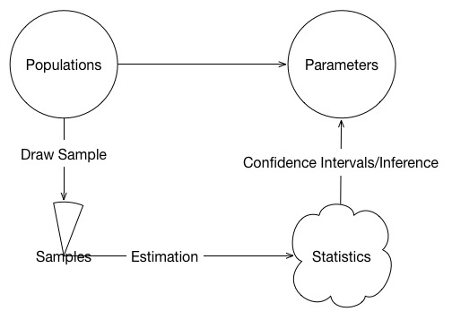

```{r, include=FALSE}
source("functions.R")
set.seed(101)
```

## Purpose of this deck

For the session, we will discuss

* What is power and how it relates to sampling distributions and the types of errors
* Reasons for doing a power analysis before you collect your data, and how that relates to the replication crisis

## What is power?

_The power of a statistical test is the probability that it will yield statistically significant results_;
Cohen (1988)

Power is the portion of the expected sampling distribution that will exceed the critical value of the test

Power is based on the critical value of the test and the sampling distribution of the test if the alternative is true.

The test's sampling distribuiton is a function of

- the size of the effect
- the sample design and sample parameters
- the sample size

# Sampling Distributions

## Samples, Statistics, Populations, Parameters

The whole point of statistics are to estimate population parameters using results from samples



## Inference

The question is, how do we judge our estimates?

The answer is sampling distributions. 

To illustrate a sampling distribution, let's first manufacture a population in `R`

```{r}
test.scores <- round(rnorm(10000,mean = 500, sd = 100))
mean(test.scores)
```

## A single sample

Let's draw a 15 person sample from this population and estimate the mean

```{r}
mean(sample(test.scores, 15))
```
It is close, but not exactly the true mean.

```{r}
mean(test.scores)
```

## Another sample

Let's get another sample
```{r}
sample.test.scores <- sample(test.scores, 15)
mean(sample.test.scores)
```

## Bunches of samples

What if we drew 2000 samples of 15?

```{r}
mean(
  replicate(2000, sample(test.scores, 15))
)
```

The mean of our sample means is pretty close to the "true" mean!

```{r}
mean(test.scores)
```

## Sampling distribution

What is the distribution of these samples means?

```{r}
hist(replicate(2000, sample(test.scores, 15)), breaks = 20)
```

It is normal!

## Standard error

The standard deviation of the sampling distribution is the standard error
```{r}
sd(replicate(2000, sample(test.scores, 15)))
```

which, for means, is what we estimate with 

$\sigma_{\bar{y}} = \frac{\sigma_y}{\sqrt{N}}$


# Hypothesis testing

## Hypothesis testing

- We wish to infer the results of a study to a population.
- We assume a particular worldview, the null hypothesis, and evaluate the likelihood that our data originate from that worldview.
- Fisher (1920): p-values are the likelihood of observing the result or one more extreme given the null hypothesis is true.
- Neyman & Pearson (1933): Hypothesis testing procedure that sets acceptable Type I and Type II error rates and compares the test statistic with a priori values.
- Power analysis is based on hypothesis testing and the selected error rates.

[Jean Biau, et al. "P Value and the Theory of Hypothesis Testing.", (2010)](http://www.ncbi.nlm.nih.gov/pmc/articles/PMC2816758/pdf/11999_2009_Article_1164.pdf)

## Types of error

* Type I error ($\alpha$): the chance of falsely rejecting the null hypothesis; convention = 0.05.
    * however, [some want the convention lower (0.005)](https://www.nature.com/articles/s41562-017-0189-z)
* Type II error ($\beta$): the chance of falsely accepting the null hypothesis; convention = 0.20.
* Power is the chance of correctly rejecting the null hypothesis when alternative is true ($1-\beta$).

## Understanding error

What exactly does $\alpha$ mean? 

If we set $\alpha$ at 0.05, then it means that 5 out of 100 false hypotheses will show up significant. 

On the next slide, we will run a simulation and graph how many of the results are past the critical value

```{r, eval=FALSE}
sim <- function(delta, n) {
  y.0 <- rnorm(n, mean = 0) #cases in control
  y.1 <- rnorm(n, mean = delta) #cases in treatment
  test <- t.test(y.1,y.0, var.equal = TRUE) #the test
  return(t = test$statistic) #return the result
}
```

## Type I error

This happens no matter what the sample size

```{r, echo = FALSE}
inputPanel(
  sliderInput("n.1", label = "sample size in each group",
              min = 2, max = 50, value = 30, step = 2)
)
renderPlot({
  errorPlot(0, input$n.1)
}, width = 1000, height = 300)

```

## Understanding error

What exactly does $\beta$ mean? 

Type II error is the chance that our test result will fall short of the critical value when the alternative is in fact true 

On the next slide, we will run a simulation and graph how many of the results fall short when we know the effect size is not zero

## Type II error

This changes with the sample size and effect size 

```{r, echo = FALSE}
inputPanel(
  sliderInput("n.2", label = "sample size in each group",
              min = 2, max = 50, value = 30, step = 2),
  
  sliderInput("delta.2", label = "effect size",
              min = 0, max = 1, value = .1, step = 0.1)
)

renderPlot({
  errorPlot(input$delta.2, input$n.2)
}, width = 1000, height = 300)

```

## Sampling distribution curves

For many tests used in research, we do not need to run simulations to determine the chance of error. 

We can use formulas and computers to determine power.

Its all about areas under curves...

## Errors from theoretical curves vs. simulation

```{r, echo = FALSE}
inputPanel(
  sliderInput("n.3", label = "Number per group",
              min = 2, max = 50, step = 1, value = 25),
  
  sliderInput("es.3", label = "Effect size",
              min = 0.1, max = 1, value = .3, step = 0.1
))


renderPlot({
  par(mfrow = c(1,2))
  exactPowerPlot(type = "srs", es = input$es.3, n = input$n.3)
  errorPlot(input$es.3, input$n.3, legend = TRUE)
}, width = 1000, height = 350)

```

## Why do power analyses?

Reasons for your funders:

* Interventions (and their evaluations) cost money.
* When the sample size is too small, and test is not significant, the answer is inconclusive and resources are wasted.

Reasons for your discipline:

* Under powered studies cede the proportion of published results to random chance findings.
  
## Replication crisis
  
- Many results from experiments could be false, and low power contributes to this. 

    * [The Economist. "Why most published scientific research is probably false." (2015); based on John Ioannidis (2005)](http://www.economist.com/blogs/graphicdetail/2013/10/daily-chart-2) 

- For example, less than half of replicated psychology results were significant. 

    * [Open Science Collaboration. "Estimating the reproducibility of psychological science." (2015)](http://www.sciencemag.org/content/349/6251/aac4716.short)

- This not only hurts science, but also scientists

    * [New York Times. "When the revolution came for Amy Cuddy." (2017)](https://www.nytimes.com/2017/10/18/magazine/when-the-revolution-came-for-amy-cuddy.html) 

- If we are not powered to find the true answers, $\alpha = 0.05$ will provide random answers to publish that will not be replicated. 

## What gets published? 

Suppose we only published significant results. 

[John Ioannidis](https://www.ncbi.nlm.nih.gov/pmc/articles/PMC1182327/) worked out formulas that relate the significance level ($\alpha$), power ($1-\beta$), and the proportion of hypotheses tested that are true ($p$), to the chance that a published finding is false. If $R = \frac{p}{1-p}$ 

+---------------------------------------+---------------------------------------+
|Published                              | Not Published                         |
+---------------------------------------+---------------------------------------+
|Truly sig. = $\frac{(1-\beta)R}{R+1}$ | Truly Null = $\frac{1-\alpha}{R+1}$  |
+---------------------------------------+---------------------------------------+
|Type I err. = $\frac{\alpha}{R+1}$     | Type II err. = $\frac{\beta R}{R+1}$  |
+---------------------------------------+---------------------------------------+

The next slide works with these formulas to show how low power helps us miss true findings and allow a portion of false findings crowd the journal pages.  

## How does low power contribute to false findings?

```{r, echo = FALSE}
inputPanel(
  sliderInput("a", label = "alpha",
              min = .001, max = .1, step = .001, value = .05),
  
  sliderInput("b", label = "power",
              min = 0.2, max = .9, value = .5, step = 0.1),
  sliderInput("p", label = "Proportion hypotheses tested that are true",
              min = 0.025, max = .8, value = .2, step = 0.025)
  )
renderPlot({
  replicationPlot(input$a, 1-input$b, input$p) 
}, width = 1000, height = 300)
```

## When to do power analyses

Before you start your study.

Power analyses guide sample design and study expectations __before__ data are collected. 

Once the data are collected, power analyses do not change the results. A power analysis does not negate a significant result. 

At best, power analyses are a post mortem for insignificant results. 

## This class

In this class we will discuss how to conduct power analysis using formulas and computers. 

This is a game of figuring out the tests and how they relate to sampling distributions (and the areas under those curves)

## What we will learn (I)

Types of power analyses:

* How to find the power of a given test, with assumptions
* How to find the sample size needed for a given test, with assumptions
* How to find the minimum detectable effect for a given test, with assumptions

## What we will learn (II)

For each of those three types of power analyses, we will learn how to accomplish the task for six designs

+---------------------+------+-----+------+
| Design              | SRST | CRT | MSRT |
+=====================+======+=====+======+
| Without Covariates  | X    | X   | X    |
+---------------------+------+-----+------+
| With Covariates     | X    | X   | X    |
+---------------------+------+-----+------+

SRST = Simple random sample trial, CRT = Cluster randomized trial, MSRT = Multi-site randomized trial


